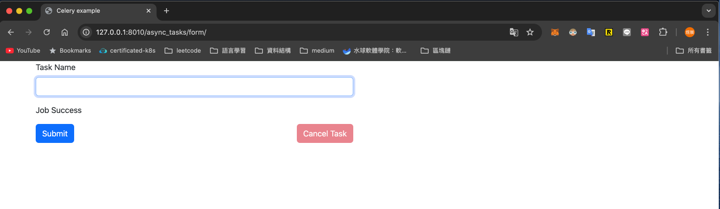

# async-tasks


## Project Structure
Below is the project directory structure:
```
.
├── LICENSE
├── README.md
├── README_ZH.md
├── alembic  # Database version control
│   ├── README
│   ├── env.py
│   ├── script.py.mako
│   └── versions
│       ├── 9fc822059594_create_task_table.py  # Migration script
├── alembic.ini
├── compose
│   └── local
│       └── fastapi
│           ├── Dockerfile
│           ├── celery
│           │   ├── beat
│           │   │   └── start  # Startup script
│           │   ├── flower
│           │   │   └── start  # Startup script
│           │   └── worker
│           │       └── start  # Startup script
│           ├── entrypoint  # check dependency services
│           └── start  # Startup script
├── docker-compose.yml
├── main.py
├── poetry.lock
├── project
│   ├── __init__.py
│   ├── async_tasks
│   │   ├── __init__.py
│   │   ├── models.py
│   │   ├── schemas.py
│   │   ├── tasks.py
│   │   ├── templates
│   │   │   └── form.html
│   │   └── views.py
│   ├── celery_utils.py
│   ├── config.py
│   ├── constants.py
│   ├── database.py
│   ├── errors.py  # TODO: Custom error handling not yet implemented
│   ├── exceptions.py  # TODO: Custom exceptions not yet implemented
│   └── logging.py  # TODO: Convert logs to JSON format
├── pyproject.toml
├── requirements.txt
├── test.db
└── tests  # pytest for testing
    ├── __init__.py
    ├── conftest.py
    └── test_async_tasks
        ├── __init__.py
        └── test_views.py
```

## Starting the Service
1. Use `docker-compose` to start the service:
   ```
   docker-compose up -d --build
   ```

2. After the service starts, you can access a simple frontend page at:
   http://127.0.0.1:8010/async_tasks/form/
   

3. The API documentation is available at: http://127.0.0.1:8010/docs


## Running Tests
1. Enter the web container:
   ```bash
   docker-compose exec web bash
   ```
   
2. Run the following command in container
   ```
   pytest -vs
   ```
   

## Flower Monitoring
Visit http://127.0.0.1:5557/tasks
You can monitor the status of Celery worker tasks here.


## Technology Choices


1. Why Celery?
When building a backend service with Python, using a message queue to decouple services is often beneficial. Celery is a good choice for this as it allows easy horizontal scaling of consumers. It also enables developers to focus on writing the logic for consumers while simplifying the configuration of the message broker and result backend. Additionally, Celery offers robust solutions for monitoring task statuses, which is a common requirement.

2. `BackgroundTasks`
FastAPI natively supports asynchronous operations and provides `BackgroundTasks` to execute tasks in the background. Please refer to the `/v2` API for an example of background task usage.
