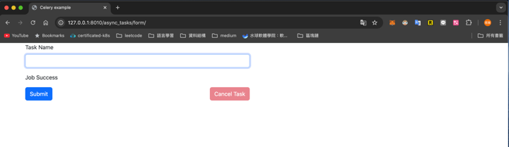

# Async Task

## 專案架構
以下為專案目錄結構
```
.
├── LICENSE
├── README.md
├── README_ZH.md
├── alembic  # 資料庫版本控制
│   ├── README
│   ├── env.py
│   ├── script.py.mako
│   └── versions
│       ├── 9fc822059594_create_task_table.py  # migration腳本
├── alembic.ini
├── compose
│   └── local
│       └── fastapi
│           ├── Dockerfile
│           ├── celery
│           │   ├── beat
│           │   │   └── start  # 啟動腳本
│           │   ├── flower
│           │   │   └── start  # 啟動腳本
│           │   └── worker
│           │       └── start  # 啟動腳本
│           ├── entrypoint  # 會做啟動服務的前置檢查
│           └── start  # 啟動腳本
├── docker-compose.yml
├── main.py
├── poetry.lock
├── project
│   ├── __init__.py
│   ├── async_tasks
│   │   ├── __init__.py
│   │   ├── models.py
│   │   ├── schemas.py
│   │   ├── tasks.py
│   │   ├── templates
│   │   │   └── form.html
│   │   └── views.py
│   ├── celery_utils.py
│   ├── config.py
│   ├── constants.py
│   ├── database.py
│   ├── errors.py  #  TODO 自定義錯誤尚未完成
│   ├── exceptions.py  #  TODO 自定義錯誤尚未完成
│   └── logging.py  # TODO 日誌改為json格式
├── pyproject.toml
├── requirements.txt
├── test.db
└── tests  # pytest進行測試
    ├── __init__.py
    ├── conftest.py
    └── test_async_tasks
        ├── __init__.py
        └── test_views.py
```


## 啟動服務
1. 使用`docker-compose`啟動服務
    ```
    docker-compose up -d --build
    ```
2. 有配置簡單的前端頁面，啟動服務後訪問
   http://127.0.0.1:8010/async_tasks/form/
   
3. 可於以下位置查看API文件
   http://127.0.0.1:8010/docs

## 執行測試
1. 進入web container
   ```
   docker-compose exec web bash
   ```
2. 執行以下命令
   ```
   root@67ddbe374905:/app#pytest -vs
   ```
   
## flower
http://127.0.0.1:5557/tasks
可以觀察celery worker任務執行的狀況

   
## 技術選擇
1. 使用Python寫後端來說，如果希望使用message queue來解偶服務，
希望可以很好的水平擴充consumer，使用celery是一個好方案
優點為可以專注在consumer邏輯的編寫，並且可以很簡單的對celery
配置broker與result backend，並且在大部分的情況，
我們都會有檢索當前任務狀況等需求，celery也為此提供相關成熟的方案。
2. FastAPI原生就支援異步，且有`BackgroundTasks`，請參考具有`/v2`
的API。